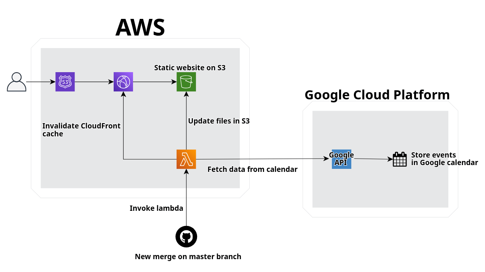

# 🗓️ Serverless Calendar Sync with AWS and GitHub Actions

A fully automated static calendar website powered by **AWS**, **Google Calendar API**, and **GitHub Actions**.

This project automatically syncs Google Calendar events to an S3-hosted static site, using an AWS Lambda function and CloudFront for global distribution.

---

## Architecture Overview

**Workflow:**
1. **GitHub Actions** triggers the **Lambda function** when code is merged into `master`.
2. The **Lambda** pulls the latest files from GitHub and the **Google Calendar API**. Lambda environment varables are used to exclude files not needed for the website, like this `README.md` or the lambda function itself.
3. It saves the updated `events.json` to **Amazon S3**.
4. **Lambda** invalidates the **Cloudfront** distribution.
4. **CloudFront** caches and serves the website securely via HTTPS.
5. **Route 53** points the domain name to the CloudFront distribution.

---

## Technologies Used

| Service | Purpose |
|----------|----------|
| **AWS Lambda** | Runs Python function to fetch calendar data and sync to S3 |
| **Amazon S3** | Hosts the static website and JSON data |
| **Amazon CloudFront** | Provides HTTPS + CDN caching |
| **Route 53** | Manages the domain and DNS |
| **Google Calendar API** | Provides live event data |
| **GitHub Actions** | Automates deployments and Lambda invocations |
| **HTML / CSS / JS** | Frontend for displaying the events calendar |

---

## Deployment Flow

1. New merge happens on `master` branch -> Github action is triggered.
2. GitHub Action invokes the AWS Lambda.
3. Lambda executes:
   - Fetch latest **events from Google Calendar**
   - Fetch latest **frontend files** from GitHub
   - Uploads everything to **S3** and invalidates **CloudFront cache**.
5. Updated site goes live automatically.

---

## AI usage disclaimer

The JavaScript and CSS for the calendar interface were developed with the help of **AI-assisted tools (ChatGPT, Github Copilot)** to accelerate implementation and styling.  
While the main body of the frontend code were created by AI tools, the initial requirements, later tweaks and fixes, as well as the infrastructure were created by me.

---

## Environment Variables (Lambda)

| Variable | Description |
|-----------|--------------|
| `BUCKET_NAME` | Target S3 bucket name |
| `CLOUDFRONT_DISTRIBUTION_ID` | CloudFront distribution ID |
| `CALENDAR_ID` | Google Calendar ID |
| `GOOGLE_API_KEY` | API key for Google Calendar |
| `EXCLUDE_PATTERNS` | paths of files in the repository to be excluded from being uploaded to S3 |
| `GITHUB_OWNER` | Name of the owner of the Github repository |
| `GITHUB_REPO` | Name of the repo to be pulled from by the lambda function |
| `GITHUB_BRANCH` | Branch of the repository to be pulled from when Lambda is triggered |

---

## GitHub Action Trigger

The GitHub workflow runs automatically on every push or merge to the `master` branch.  
It uses a dedicated IAM user with limited `lambda:InvokeFunction` permissions to trigger the Lambda securely.

---

## Further improvement possibilities

- Divide the lambda function into two separate lamdba functions:
    - First one triggered by the Existing Github Action and only fetching and updating the static files in the repository
    - Second one triggered by a webhook or another event that is driven by an update in the calendar (eg. new event added, rescheduled, removed)
